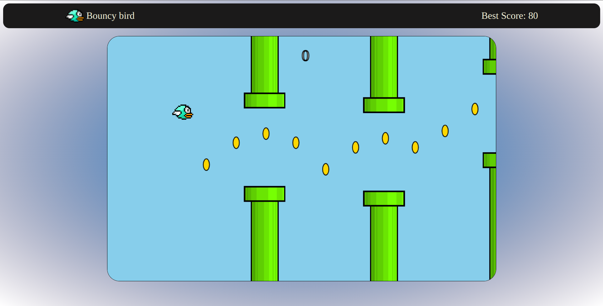

# Bouncy-Bird
## :fire: Description 
- It is a Flappy Bird clone made from :writing_hand: scratch with JavaScript and sprites are drawn with Pixilart.
## :bulb: What's new :
- It contain's coins generator.
- The score here is based on the number of collected coins not passed pipes. 
## :eyes: Preview:
 </img>
## :video_game: How to Play it:
- Simply you can play it from <a href="https://ahmedwelhakim.github.io/Bouncy-Bird/"> Here</a>
- You can play it from your :iphone: mobile or :computer: pc.
## :computer: Installation
- Just Clone it, or download the zip file code from <a href="https://github.com/ahmedwelhakim/Bouncy-Bird/archive/refs/heads/master.zip"> here </a> 
- Then run index.html with your browser.

## :scroll: Note:
- Feel free to use it or modify it.
- Forking it and pull request is appreciated.
